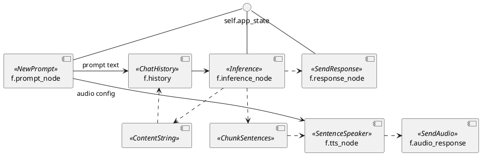

# Flowno Assistant: System Architecture

This document is intended for my future self, other developers and LLMs to quickly understand the architecture of the Flowno Assistant application.

## Repository Layout

```
.
├── src/
│   ├── main-entry.ts           # Electron main process entry
│   ├── renderer-entry.ts       # Renderer process entry
│   ├── renderer-preload.ts     # Preload script for renderer
│   ├── components/             # Shared React components
│   ├── contexts/               # React context providers
│   ├── core/                   # Core utilities/types
│   ├── features/               # Feature-sliced modules
│   │   └── chat/
│   │       ├── main/           # Main-process logic for chat feature
│   │       └── renderer/       # Renderer components for chat
│   ├── infra/                  # Infrastructure code
│   │   ├── IPCChannels.ts      # IPC channel constants
│   │   ├── ipc/                # Message schema definitions
│   │   ├── main/               # Main process services
│   │   │   ├── MainWindow/     # Main window management
│   │   │   └── SettingsWindow/ # Settings window management
│   │   ├── native/
│   │   │   └── electron-flowno-bridge/  # Native Node.js module (moved from external repo)
│   │   │       ├── native/              # C++ source code
│   │   │       ├── python/              # Python callback bridge
│   │   │       ├── resources/           # Embedded Python interpreter
│   │   │       └── build-deps.sh        # Script to build embedded Python
│   │   ├── python/
│   │   │   └── primary-interp/          # Embedded Python application
│   │   │       ├── src/FlownoApp/       # Python source code
│   │   │       │   ├── app.py           # Main application entry
│   │   │       │   ├── ipc/             # IPC handlers and registry
│   │   │       │   ├── messages/        # Message schemas and types
│   │   │       │   ├── nodes/           # Flowno dataflow nodes
│   │   │       │   └── utils/           # Utility functions
│   │   │       └── tests/               # Python tests
│   │   └── renderer/                    # Renderer-side services
│   └── styles/                          # Global CSS
├── images/                              # Application assets
├── python-dev-venv-embedded/            # Development virtual environment
├── forge.config.mjs                     # Electron Forge config
├── webpack.*.config.mjs                 # Webpack configurations
├── tsconfig.json                        # TypeScript config
├── tailwind.config.js                   # Tailwind CSS config
├── package.json
└── ARCHITECTURE.md                      # This document
```

The application also depends on the external [`flowno`](https://github.com/computemachines/flowno) repository, a Python dataflow framework used by the embedded Python application.

## Overview

Flowno Assistant is an LLM frontend designed to explore practical, self-modifying agent architectures. It uses the `flowno` dataflow framework for its core logic.

### System Components

The system consists of four key parts:

1.  **Flowno-Assistant** - The main Electron application (UI and orchestrator).  
    *Repository (this)*: https://github.com/computemachines/flowno-assistant
2.  **electron-flowno-bridge** - A native Node.js module embedding Python and enabling IPC between Electron (Node.js) and Python.  
    *Location (this repo)*: https://github.com/computemachines/flowno-assistant/tree/main/src/infra/native/electron-flowno-bridge
3.  **flowno** - The Python dataflow framework used for its core logic.  
    *Repository*: https://github.com/computemachines/flowno  
    *Docs*: https://flowno.net/docs
4.  **primary-interp** - The Python application logic running within the embedded interpreter, structured using `flowno`.  
    *Location (this repo)*: https://github.com/computemachines/flowno-assistant/tree/main/src/infra/python/primary-interp

### Long-term Goal

The project aims to enable two kinds of self-modification:
1.  **Graph Self-Modification (Structural)**: Runtime modification of the `flowno` graph itself (adding/removing nodes, changing connections).  
    (Requires computemachines/flowno#12, computemachines/flowno#8)
2.  **Node Source Code Modification (Behavioral)**: Dynamic definition and evaluation of new node logic within a restricted Python environment.  
    (Requires a secondary interpreter, some way to mark group nodes as "unsafe", and transparent data passing between nodes running in different interpreters. Complicated to do right.)

## Core Concepts & Dataflow

### Flowno Dataflow Graph

The core application logic resides in the `primary-interp` Python code and is structured as a (cyclic) directed graph using the `flowno` framework.

**Key Characteristics:**
-   **Reactive Execution**: Nodes run when their inputs are available.
-   **Concurrency**: The `flowno` scheduler manages concurrent execution within a single thread.
-   **Cyclic Graphs**: Supports cycles, essential for conversational loops where history influences future inferences.
-   **Streaming**: Nodes can produce and consume streams of data. The the current graph uses this to start the TTS engine and send audio chunks to the frontend before the entire response is generated.

**Current Graph (`src/infra/python/primary-interp/src/FlownoApp/app.py`):**
```python
# Create the cyclic Flowno graph
with FlowHDL() as f:
    # NewPrompt receives prompts from queue. self.app_state is not a node instance
    # f.prompt_node outputs two values: the prompt (output 0) and an audio config (output 1)
    # all other nodes only output a single value (or stream a series of single values)
    # node is equivalent to node.output(0) in arguments
    f.prompt_node = NewPrompt(self.app_state)
    
    # Uses a forward reference here to the history node, creating a cycle
    # f.history is a node instance, Inference will evaluate with history's output
    # as an argument
    f.inference_node = Inference(f.history, self.app_state)

    # This node accepts a stream of chunks and sends them to the frontend
    f._response_node = SendResponse(f.inference_node, self.app_state)
    
    # ChatHistory receives prompts and accumulated response content
    f.history = ChatHistory(f.prompt_node.output(0), ContentString(f.inference_node))

    # SentenceSpeaker receives a stream of sentences and yields a stream of audio chunks
    f.tts_node = SentenceSpeaker(
        ChunkSentences(f.inference_node),   # Chunk the inference output into sentences
        f.prompt_node.output(1),            # The second output of the prompt node is an audio config
        self.app_state
    )

    f._audio_response = SendAudio(f.tts_node, self.app_state)

self.f = f

# ...

def run(self):
    self.f.run_until_complete()
```

**Diagram:**


## Process Architecture

The application adheres to Electron's standard multi-process architecture:

1.  **Main Process:** A single Node.js process responsible for managing the application lifecycle, creating windows, handling system interactions, and orchestrating communication.
2.  **Renderer Process(es):** One Chromium process per application window (e.g., the main chat window, settings window), responsible for rendering the user interface (React).

The core application logic, implemented in Python using the `flowno` framework, runs within an embedded Python interpreter. This interpreter is launched and managed by the **Main Process** via the `electron-flowno-bridge` native Node.js module.

**Execution Model & Threading:**

*   **Node.js (Main Process):** Runs the Electron application logic and the Node.js event loop.
*   **C++ Native Module (`electron-flowno-bridge`):** Loaded into the Node.js Main Process. When its `PythonRunner.start()` method is called, it spawns a new `std::thread`.
*   **Python (`primary-interp`):** The embedded Python interpreter and the `flowno` application logic execute entirely within this separate `std::thread` created by the C++ module.

**Key Points:**

*   The Python code runs *concurrently* with the Node.js event loop but *within the same main process*.
*   Blocking operations within the Python code (like running the `flowno` graph) happen on the dedicated Python thread and **do not block** the Node.js event loop, ensuring the UI remains responsive.
*   Communication between the Node.js main process event loop and the Python thread is managed by the C++ bridge, involving mechanisms to safely pass messages across thread boundaries (e.g., thread-safe queues, Napi::ThreadSafeFunction). Messages are serialized to JSON for transport.

1.  **Electron Main Process (`src/main-entry.ts`, `src/infra/main/`)**: Handles window management, system integration, and orchestrates communication with the Python backend via the bridge.
2.  **Electron Renderer Process (`src/renderer-entry.ts`, `src/components/`, `src/features/*/renderer/`)**: Manages the UI (React) and communicates with the electron Main process via Electron IPC.
3.  **Embedded Python (`src/infra/python/primary-interp/`)**: Runs the `flowno` graph and core application logic, communicating with the electron Main process via the bridge.

## Component Architecture

### 1. Flowno-Assistant (Electron App)

-   **Technologies**: Electron, TypeScript, React
-   **Build System**: Yarn, Webpack, Electron Forge, Tailwind CSS (via postcss-loader)
-   **Role**: Provides the UI, manages the application lifecycle, and acts as the central hub connecting the UI to the Python backend.
-   **Structure**: Organized using a combination of infrastructure layers (`src/infra/main`, `src/infra/renderer`) and feature slices (`src/features/*/{main,renderer}`). Feature slices group UI components (`features/*/renderer/`) and main-process logic (`features/*/main/`) related to a specific domain (e.g., chat). Shared UI elements are in `src/components/`.
-   **Key Files**:
    -   `src/main-entry.ts`: Entry point for the Electron main process.
    -   `src/renderer-entry.ts`: Entry point for the Electron renderer process.
    -   `src/index.html`: Main HTML file for the renderer process.
    -   `src/renderer-preload.ts`: Preload script for the renderer process, exposing APIs to the renderer via Electron's context bridge.
    -   `src/infra/main/IPCRegistry.ts`: Centralized IPC registry for routing messages between the main process and injected dependencies (e.g., `IElectronFlownoBridge`).
-   **Build Artifacts**: 
    -   `out/`: Packaged Electron app (after running `yarn package` or `yarn make`).
    -   `.webpack/`: Webpack build artifacts (after running `yarn start` or `yarn exec -- webpack --config webpack.main.config.mjs`).

### 2. electron-flowno-bridge (Native Node.js Module)

-   **Technologies**: C++, Node-API, Python C API
-   **Build System**: CMake-js, Clang, custom build scripts (`build-deps.sh`)
-   **Role**: Embeds a Python interpreter within the Node.js runtime and provides a bidirectional communication channel.
-   **Key Components**:
    -   `PythonEnvironment`: C++ Class. Manages embedded Python setup.
    -   `PythonRunner`: Node.js native class providing the JS interface (`start`, `sendMessage`).
    -   `nodejs_callback_bridge`: Python C extension module enabling Python to call back into Node.js.
-   **Architectural Patterns**:
    -   **Cross-Language Bridge**: Implements a bidirectional bridge allowing JSON-serialized messages and callbacks between JavaScript (Electron Main) and Python (`primary-interp`).
        
        ```plantuml
        @startuml

        component "Electron Main Process (Node.js)" as main_process {
            component "Python Interpreter Thread" as python_interpreter {
                class "nodejs_callback_bridge" as nodejs_callback_bridge {
                send_message(message: object)
                }
            }
            component "Node.js Thread" as node_thread {
                class "PythonRunner" as python_runner{
                sendMessage(message: Any)
                start()
                waitForCompletion()
                }
            }
        }
        main_process.python_interpreter <- main_process.node_thread.python_runner::start : Creates std::thread running Python
        main_process.python_interpreter.nodejs_callback_bridge::send_message -> main_process.node_thread : schedules callback to\n run in main process via. \n Napi::ThreadSafeFunction
        main_process.python_interpreter.nodejs_callback_bridge <-- main_process.node_thread.python_runner::sendMessage : invokes python callback \n (GIL acquired, run in main process)
        @enduml
        ```

        This has implications for message handlers:
        - **Python**: Callbacks on the Python side are executed in the main process thread, not the Python thread. Because of the GIL, both threads are blocked while the callback is running. Do not run long-running tasks in the callback. Node.js will be blocked until the callback returns.
        - **Node.js**: Callbacks on the Node.js side are *requested* from the Python thread, but *executed* in the main process thread. Blocking operations in the callback will only block the main process thread.


### 3. flowno (Python Dataflow Framework)

-   **Technologies**: Pure Python
-   **Role**: Provides the underlying dataflow engine and scheduler.
-   **PyPI**: pip install [flowno](https://pypi.org/project/flowno/)
-   **Key Components**:
    -   `FlowHDL`: Context manager for defining graphs.
    -   `@node`: Decorator for creating dataflow nodes from async functions.
-   **Reminder**: The `flowno` framework DOES NOT use `asyncio` for scheduling. Import primitives such as `sleep` from `flowno` NOT `asyncio`. If you ever import `asyncio` in the Python code you are likely doing something wrong!

### 4. primary-interp (Python Application)

-   **Location**: `src/infra/python/primary-interp` within the `flowno-assistant` repo.
-   **Technologies**: Python, flowno, spacy for SBD
-   **Role**: Implements the specific chatbot functionality using the `flowno` framework. Runs *within* the embedded interpreter managed by `electron-flowno-bridge`.
-   **Key Files**:
    -   `src/FlownoApp/app.py`: Defines the main `flowno` graph.
    -   `src/FlownoApp/ipc/registry.py`: Handles incoming messages from Electron.
    -   `src/FlownoApp/nodes/`: Contains the logic for individual dataflow nodes.

## Implementation Details

### IPC Message Flow

Communication flows through the following path:

1.  **Frontend (Renderer) → Preload Script**: The renderer process calls methods exposed by the context bridge (`window.electron.ElectronFlownoBridge.send`, etc.).

2.  **Preload Script → Main Process**: The preload script (`renderer-preload.ts`) forwards these calls to the main process using Electron's IPC mechanism:
    ```typescript
    // In renderer-preload.ts
    contextBridge.exposeInMainWorld("electron", {
      ElectronFlownoBridge: {
        // ...
        send: (message: any) => ipcRenderer.invoke(IPC_ElectronFlownoBridge_send, message),
        // ...
      }
    });
    ```

3.  **Main Process → ElectronFlownoBridge**: The `IPCRegistry` in the main process routes these IPC calls to the appropriate method in `ElectronFlownoBridge`:
    ```typescript
    // In IPCRegistry.ts
    ipcMain.handle(
      IPC_ElectronFlownoBridge_send,
      this.flownoBridge.send.bind(this.flownoBridge),
    );
    ```

4.  **ElectronFlownoBridge → C++ Native Module**: The `ElectronFlownoBridge` passes the raw JavaScript object to the native module:
    ```typescript
    // In ElectronFlownoBridge.ts
    async send(_event: IpcMainEvent, message: any): Promise<void> {
      // ...
      this.pythonRunner.send(message);
      // ...
    }
    ```

5.  **C++ Native Module → Python**: The native `PythonRunner.cpp` explicitly serializes the JavaScript object to JSON before invoking the Python callback (from the nodejs thread):
    ```cpp
    // In PythonRunner.cpp (C++ code)
    // Get JavaScript's JSON object and call stringify
    Napi::Object JSON = global.Get("JSON").As<Napi::Object>();
    Napi::Function stringifyFunc = JSON.Get("stringify").As<Napi::Function>();
    Napi::String jsonString = stringifyFunc.Call({info[0]}).As<Napi::String>();
    message = jsonString.Utf8Value();
    
    // Pass the JSON string to Python
    PyObject* pyJsonString = PyUnicode_FromString(message.c_str());
    PyObject_CallFunctionObjArgs(pMessageListenerCallback_, pyJsonString, nullptr);
    ```
    The JSON string is then passed to Python where it's parsed back into a Python object in the message listener.

6.  **Python → JavaScript (Message Send)**: To send messages from Python to JavaScript, you import the `nodejs_callback_bridge` module and use it to send message objects:
    ```python
    # In a Python node or handler function
    import nodejs_callback_bridge
    from FlownoApp.messages.ipc_schema import MessageUpdatedResponse, MessageUpdatedPayload
    
    def send_message_to_frontend(message_obj):
        # Create a proper message using the dataclass schemas
        payload = MessageUpdatedPayload(message=message_obj)
        response = MessageUpdatedResponse(type="message-updated", payload=payload)
        
        # The bridge will handle JSON serialization using the registered encoder
        nodejs_callback_bridge.send_message(response)
        
    # Example usage in a node or handler:
    # When a message is updated, notify the frontend
    updated_msg = get_updated_message()
    send_message_to_frontend(updated_msg)
    ```
    All message objects must be json serializable by the set encoder (`nodejs_callback_bridge.set_json_encoder(encoder)`).

7.  **Python → C++ Extension**: When sending messages back to JavaScript, the Python `nodejs_callback_bridge` wrapper handles the JSON serialization:
    ```python
    # In nodejs_callback_bridge/__init__.py
    def send_message(message: Any) -> None:
        # Serialize Python object to JSON here
        if _json_encoder is not None:
            json_string = json.dumps(message, cls=type(_json_encoder))
        else:
            json_string = json.dumps(message)
        
        # Send the JSON string to C++
        return _nodejs_callback_bridge._send_string(json_string)
    ```

8. **Main Process → Frontend (Renderer)**: When the Node.js event loop processes the queued callback from Python, the JS message listener registered in the `ElectronFlownoBridge` runs, forwarding the message to the renderer process:

    ```typescript
    // In ElectronFlownoBridge.ts
    constructor(private pythonPath: string) {
      // ...
      this.pythonRunner = new PythonRunner();
    }

    initialize(): void {
      // ...
      // Register a callback that will be invoked when Python sends a message
      this.pythonRunner.registerMessageListener((message) => {
        // message is already parsed from JSON to a JavaScript object by this point
        if (this.mainWindow) {
          this.mainWindow.webContents.send(IPC_ElectronFlownoBridge_messageForRenderer, message);
        }
      });
    }
    ```

    This callback registration creates a `ThreadSafeFunction` in the C++ code:

    ```cpp
    // In PythonRunner.cpp
    Napi::Value PythonRunner::RegisterMessageListener(const Napi::CallbackInfo& info) {
      Napi::Env env = info.Env();
      
      // Store the callback function from JavaScript
      if (info.Length() < 1 || !info[0].IsFunction()) {
        throw Napi::TypeError::New(env, "Function expected as argument");
      }
      
      // Create a NodeCallbackBridgeFn with the JS callback function
      callbackBridge = std::make_unique<NodeCallbackBridgeFn>(env, info[0].As<Napi::Function>());
      
      // ...set up Python side to use this bridge...
      
      return env.Undefined();
    }
    ```

    The `NodeCallbackBridgeFn` constructor creates the thread-safe function:

    ```cpp
    // In NodeCallbackBridgeFn.hpp
    NodeCallbackBridgeFn(Napi::Env env, Napi::Function callback)
      : tsfn_(Napi::ThreadSafeFunction::New(
            env,
            callback,              // ← the JS callback you passed
            "ElectronFlownoBridge",// a debug name
            0,                     // unlimited queue size
            1                      // only one thread will use it
        )),
        env_(env)
    {}
    ```

7.  **Python → C++ → Node.js Scheduling**: When `nodejs_callback_bridge.send_message()` is called from Python, it serializes the message to JSON and calls the internal C extension method `_send_string()`:

    ```python
    # In nodejs_callback_bridge/__init__.py
    def send_message(message: Any) -> None:
        # Serialize Python object to JSON here
        if _json_encoder is not None:
            json_string = json.dumps(message, cls=type(_json_encoder))
        else:
            json_string = json.dumps(message)

        # Send the JSON string to C++
        return _nodejs_callback_bridge._send_string(json_string)
    ```

    The C extension's `_send_string` implementation locates the `NodeCallbackBridgeFn` instance and calls its `EnqueueCallback` method:

    ```cpp
    // In PythonCallbackModule.cpp
    static PyObject* _send_string(PyObject* self, PyObject* args) {
        const char* message;
        if (!PyArg_ParseTuple(args, "s", &message)) {
            return NULL;
        }

        if (!callbackBridge) {
            PyErr_SetString(PyExc_RuntimeError, "No callback registered");
            return NULL;
        }

        // This is where the magic happens - schedule the callback to run in the Node.js thread
        napi_status status = callbackBridge->EnqueueCallback(message);
        // ...error handling...
        
        Py_RETURN_NONE;
    }
    ```

    The `EnqueueCallback` method itself wraps the JSON string in a lambda and schedules it to run on the Node.js main thread:

    ```cpp
    // In NodeCallbackBridgeFn.cpp
    napi_status NodeCallbackBridgeFn::EnqueueCallback(const std::string &message) {
      // Define a lambda that will call the stored JS callback with the message.
      auto callback = [message](Napi::Env env, Napi::Function jsCallback) {
        // Parse the JSON string into a JavaScript object
        Napi::String jsonNapiString = Napi::String::New(env, message);
        Napi::Object global = env.Global();
        Napi::Object JSON = global.Get("JSON").As<Napi::Object>();
        Napi::Function parseFunc = JSON.Get("parse").As<Napi::Function>();
        Napi::Value jsObject = parseFunc.Call({jsonNapiString});
        
        // Call the callback with the parsed JavaScript object
        jsCallback.Call({jsObject});
      };

      // Use the ThreadSafeFunction to schedule the callback on the Node.js thread.
      return tsfn_.NonBlockingCall(callback);
    }
    ```

    When the Node.js event loop runs next, it will execute this lambda, parse the JSON string back into a JavaScript object, and pass it to the callback function registered by the main process.

8.  **Main Process → Frontend (Renderer)**: When the Node.js event loop processes the queued callback from Python, the JS message listener registered in the `ElectronFlownoBridge` runs, forwarding the message to the renderer process:

    ```typescript
    // In ElectronFlownoBridge.ts
    constructor(private pythonPath: string) {
      // ...
      this.pythonRunner = new PythonRunner();
    }

    initialize(): void {
      // ...
      // Register a callback that will be invoked when Python sends a message
      this.pythonRunner.registerMessageListener((message) => {
        // message is already parsed from JSON to a JavaScript object by this point
        if (this.mainWindow) {
          this.mainWindow.webContents.send(IPC_ElectronFlownoBridge_messageForRenderer, message);
        }
      });
    }
    ```

### Message Schema Design

The application uses a structured approach to define message schemas for IPC communication between the Electron and Python components:

- **Python**: Uses dataclasses in `messages/ipc_schema.py` to define strongly-typed message structures
- **TypeScript**: Uses TypeScript classes in `src/infra/shared/ipc/MessageSchemas.ts` to define equivalent message types

Parallel type definitions are maintained in Python and TypeScript and must be kept in sync manually.

#### Python Schema Example (using dataclasses):

```python
@dataclass
class NewPromptPayload:
    id: str
    role: Literal["user", "system"]
    content: str

@dataclass
class NewPromptMessage(IPCMessageBase):
    type: Literal["new-prompt"]
    content: NewPromptPayload
```

#### TypeScript Schema Example (using classes):

```typescript
export class NewPromptPayload {
  constructor(
    public id: string,
    public role: "user" | "system",
    public content: string
  ) {}
}

export class NewPromptMessage implements IPCMessageBase {
  public type: "new-prompt" = "new-prompt";
  
  constructor(public content: NewPromptPayload) {}
}
```

## Dependencies & Setup

### Current Runtime Dependencies

-   OpenAI-compatible completion API endpoint
-   OpenAI-compatible audio API endpoint (e.g., https://github.com/remsky/Kokoro-FastAPI)

### Development Environment

*   **Node.js & Yarn:** Required for the Electron app, building, and dependency management.
*   **C++ Compiler & CMake:** Required for building the native `electron-flowno-bridge` module.
*   **patchelf:** Required by `build-deps.sh` to make the embedded Python portable.

### Build Process

This section outlines the steps for a clean build and explains the separate dependency handling for development vs. production.

**1. Clean Workspaces:**

Remove previous build artifacts and dependencies.
```bash
# Clean Flowno-Assistant
cd /path/to/flowno-assistant
rm -rf dist/ out/ node_modules/ python-dev-venv-embedded/

# Clean electron-flowno-bridge
rm -rf src/infra/native/electron-flowno-bridge/build \
    src/infra/native/electron-flowno-bridge/native/build/ \
    src/infra/native/electron-flowno-bridge/dist/ \
    src/infra/native/electron-flowno-bridge/resources/* 
    src/infra/native/electron-flowno-bridge/node_modules/
```

**2. Build Embedded Python (within electron-flowno-bridge):**

Builds the portable Python distribution using `build-deps.sh`. This creates the base interpreter in `electron-flowno-bridge/resources/x86_64-linux/python/`.

```bash
cd /path/to/electron-flowno-bridge
./build-deps.sh
```

*   **Important:** This step only builds the *base* Python interpreter. Application dependencies are handled separately for dev/prod.

**3. Building electron-flowno-bridge Native Module:**

After building the embedded Python, you need to build the native Node.js module that bridges Electron and Python:

```bash
cd src/infra/native/electron-flowno-bridge
yarn install  # Install Node.js dependencies
yarn build    # Build the native module
```

**4. Install Node.js Dependencies (Flowno-Assistant):**

Installs Electron, React, build tools, and importantly, `electron-flowno-bridge`. Yarn creates a symlink: `flowno-assistant/node_modules/electron-flowno-bridge` -> `/path/to/electron-flowno-bridge`.

```bash
cd /path/to/flowno-assistant
yarn install
```

**5. Setup Python Dependencies (Development vs. Production):**

Python dependencies for `FlownoApp` (`primary-interp`) are installed differently depending on the workflow:

*   **Development (`yarn start`)**  
  1. Create venv from embedded Python:
     ```bash
     cd /path/to/flowno-assistant
     ./node_modules/electron-flowno-bridge/resources/x86_64-linux/python/bin/python3.12 \
       -m venv python-dev-venv-embedded
     ```
  3. Install the FlownoApp & deps in editable mode:
     ```bash
     ./python-dev-venv-embedded/bin/pip install -e src/infra/python/primary-interp
     ./python-dev-venv-embedded/bin/python -m spacy download en_core_web_sm
     ```
  *   **Running:**
        ```bash
        cd /path/to/flowno-assistant
        yarn start
        ```
    *   **Code:** `ElectronFlownoBridge.ts` sets `python_home` to the venv path and passes an empty `extra_search_paths` array during development.

*   **Production (`yarn package` or `yarn make`):**
    *   Electron Forge copies the *clean* base embedded Python from `src/infra/native/electron-flowno-bridge/resources` into the packaged app (`/out/...`).
    *   The `python_home` passed to the native `PythonRunner` is the path to the packaged embedded Python (`<...>/electron-flowno-bridge/resources/x86_64-linux/python`).
    *   The `postPackage` hook in `forge.config.mjs` runs *after* packaging.
    *   It uses the *packaged app's embedded pip* to install the pre-built `FlownoApp` wheel (`primary_interp-*.whl`) and its dependencies (e.g., downloading spaCy models) directly into the packaged app's Python `site-packages`.
    *   **Setup:** Ensure the `FlownoApp` wheel is built before packaging:
        ```bash
        cd /path/to/flowno-assistant/src/infra/python/primary-interp
        # Ensure 'build' package is installed in the env used for building
        python -m build 
        ```
    *   **Running:**
        ```bash
        cd /path/to/flowno-assistant
        yarn package # or yarn make
        ```

## Further Documentation

-   **flowno**: Comprehensive docs at https://flowno.net/docs
-   **primary-interp**: See `src/infra/python/primary-interp/README.md`
-   *(TODO: Add doxygen for C++ code in electron-flowno-bridge)*