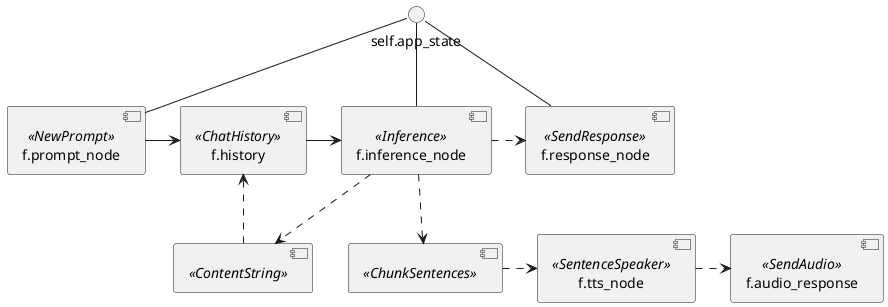

# Flowno Assistant: System Architecture

## Repository Layout

```
.
├── src/
│   ├── main-entry.ts       # Electron main process entry
│   ├── renderer-entry.ts   # Renderer process entry
│   ├── renderer-preload.ts # Preload script for renderer
│   ├── components/         # Shared React components
│   ├── contexts/           # React context providers
│   ├── core/               # Core utilities/types
│   ├── features/           # Feature-sliced modules
│   │   └── chat/
│   │       ├── main/       # Main-process logic for chat feature
│   │       └── renderer/   # Renderer components for chat
│   ├── infra/              # Infrastructure code
│   │   ├── IPCChannels.ts  # IPC channel constants
│   │   ├── ipc/            # Message schema definitions
│   │   ├── main/           # Main process services
│   │   ├── native/
│   │   │   └── electron-flowno-bridge/  # Native Node.js module (moved from external repo)
│   │   │       ├── native/              # C++ source code
│   │   │       ├── python/              # Python callback bridge
│   │   │       ├── resources/           # Embedded Python interpreter
│   │   │       └── build-deps.sh        # Script to build embedded Python
│   │   ├── python/
│   │   │   └── primary-interp/          # Embedded Python application
│   │   │       ├── src/FlownoApp/       # Python source code
│   │   │       │   ├── app.py           # Main application entry
│   │   │       │   ├── ipc/             # IPC handlers and registry
│   │   │       │   ├── messages/        # Message schemas and types
│   │   │       │   ├── nodes/           # Flowno dataflow nodes
│   │   │       │   └── utils/           # Utility functions
│   │   │       └── tests/               # Python tests
│   │   └── renderer/                    # Renderer-side services
│   └── styles/                          # Global CSS
├── images/                              # Application assets
├── python-dev-venv-embedded/            # Development virtual environment
├── forge.config.mjs                     # Electron Forge config
├── webpack.*.config.mjs                 # Webpack configurations
├── tsconfig.json                        # TypeScript config
├── tailwind.config.js                   # Tailwind CSS config
├── package.json                         # Node.js dependencies
└── ARCHITECTURE.md                      # This document
```

The application also depends on the external [`flowno`](https://github.com/computemachines/flowno) repository, a Python dataflow framework used by the embedded Python application.

## Overview

Flowno Assistant is an LLM frontend designed to explore dynamic, self-modifying AI architectures. It uses the `flowno` dataflow framework for its core logic, enabling a reactive and concurrent system.

### System Components

The system consists of four key parts:

1.  **Flowno-Assistant** - The main Electron application (UI and orchestrator).
    *Repository (this)*: https://github.com/computemachines/flowno-assistant
2.  **electron-flowno-bridge** - A native Node.js module embedding Python and enabling IPC between Electron (Node.js) and Python.
    *Repository*: https://github.com/computemachines/electron-flowno-bridge
3.  **flowno** - The Python dataflow framework used for the core logic.
    *Repository*: https://github.com/computemachines/flowno
    *Docs*: https://flowno.net/docs
4.  **primary-interp** - The Python application logic running within the embedded interpreter, structured using `flowno`.
    *Location*: Resides within the Flowno-Assistant repository at `src/infra/python/primary-interp`.

### Long-term Goal

The project aims to enable two kinds of self-modification:
1.  **Graph Self-Modification (Structural)**: Runtime modification of the `flowno` graph itself (adding/removing nodes, changing connections). (Requires flowno#12, flowno#8)
2.  **Node Source Code Modification (Behavioral)**: Dynamic definition and evaluation of new node logic within a restricted Python environment.

## Core Concepts & Dataflow

### Flowno Dataflow Graph

The core application logic resides in the `primary-interp` Python code and is structured as a directed graph using the `flowno` framework.

**Key Characteristics:**
-   **Reactive Execution**: Nodes run when their inputs are available.
-   **Concurrency**: The `flowno` scheduler manages concurrent execution within a single thread.
-   **Cyclic Graphs**: Supports cycles, essential for conversational loops where history influences future inferences.

**Current Graph (`src/infra/python/primary-interp/src/FlownoApp/app.py`):**
```python
# Create the cyclic Flowno graph
with FlowHDL() as f:
    # NewPrompt receives prompts from queue and sends chunks to the frontend
    f.prompt_node = NewPrompt(self.app_state)
    
    # Uses a forward reference here to the history node, creating a cycle
    f.inference_node = Inference(f.history, self.app_state)

    # This node accepts a stream of chunks and sends them to the frontend
    f.response_node = SendResponse(f.inference_node, self.app_state)
    
    # ChatHistory receives prompts and accumulated response content
    f.history = ChatHistory(f.prompt_node, ContentString(f.inference_node))

    # SentenceSpeaker receives a stream of sentences and yields a stream of audio chunks
    f.tts_node = SentenceSpeaker(ChunkSentences(f.inference_node), self.app_state)

    f.audio_response = SendAudio(f.tts_node, self.app_state)

self.f = f

# ...

def run(self):
    self.f.run_until_complete()
```

**Diagram:**


## Component Breakdown

The application follows a layered approach based on execution context, separating UI concerns (Renderer), system-level tasks (Main), and core dataflow logic (Python).

1.  **Electron Main Process (`src/main-entry.ts`, `src/infra/main/`)**: Handles window management, system integration, and orchestrates communication with the Python backend via the bridge.
2.  **Electron Renderer Process (`src/renderer-entry.ts`, `src/components/`, `src/features/*/renderer/`)**: Manages the UI (React) and communicates with the Main process via Electron IPC.
3.  **Embedded Python (`src/infra/python/primary-interp/`)**: Runs the `flowno` graph and core application logic, communicating with the Main process via the bridge.

### 1. Flowno-Assistant (Electron App)

-   **Technologies**: Electron, TypeScript, React
-   **Build System**: Yarn, Webpack, Electron Forge, Tailwind CSS
-   **Role**: Provides the UI, manages the application lifecycle, and acts as the central hub connecting the UI to the Python backend.
-   **Structure**: Organized using a combination of infrastructure layers (`src/infra/main`, `src/infra/renderer`) and feature slices (`src/features/`). Feature slices group UI components (`features/*/renderer/`) and main-process logic (`features/*/main/`) related to a specific domain (e.g., chat). Shared UI elements are in `src/components/`.
-   **Key Files**:
    -   `main-entry.ts`: Entry point for the Electron main process.
    -   `renderer-entry.ts`: Entry point for the Electron renderer process.
    -   `src/infra/main/ElectronFlownoBridge.ts`: Facade over the native bridge module.
    -   `src/features/chat/renderer/ChatWindow.tsx`: Example feature component.
-   **Architectural Patterns**:
    -   **Dependency Injection**: Used in the main process (e.g., `MainWindow`, `IPCRegistry`) to inject dependencies like services and the bridge, promoting testability.
      ```typescript
      // Example from MainWindow/index.ts
      constructor(
        private dummyService: IDummyService,
        private flownoBridge: IElectronFlownoBridge, // Injected facade
      ) { /* ... */ }
      ```
    -   **Facade Pattern**: The `ElectronFlownoBridge` TypeScript class provides a simplified, typed interface over the lower-level `PythonRunner` native module, abstracting away IPC complexities.

### 2. electron-flowno-bridge (Native Node.js Module)

-   **Technologies**: C++, Node-API, Python C API
-   **Build System**: CMake-js, Clang, custom build scripts (`build-deps.sh`)
-   **Role**: Embeds a Python interpreter within the Node.js runtime and provides a bidirectional communication channel.
-   **Key Components**:
    -   `PythonEnvironment`: C++ Class. Manages embedded Python setup.
    -   `PythonRunner`: Node.js native class providing the JS interface (`start`, `sendMessage`).
    -   `nodejs_callback_bridge`: Python C extension module enabling Python to call back into Node.js.
-   **Architectural Patterns**:
    -   **Cross-Language Bridge**: Implements a bidirectional bridge allowing JSON-serialized messages and callbacks between JavaScript (Electron Main) and Python (`primary-interp`).
      ```plantuml
      @startuml

      component "Python Interpreter" as python_interpreter {
        class "nodejs_callback_bridge" as nodejs_callback_bridge {
          send_message(message: object)
          register_callback(callback_id: str, callback: Callable)
        }
      }
      component "Electron Main Process (Node.js)" as main_process {
        class "PythonRunner" as python_runner{
          sendMessage(message: Any)
          start()
          waitForCompletion()
        }
      }
      python_interpreter <- main_process.python_runner::start : Creates std::thread running Python
      python_interpreter.nodejs_callback_bridge::send_message -> main_process : schedules callback to run in main process
      python_interpreter.nodejs_callback_bridge <-- main_process.python_runner::sendMessage : invokes python callback \n (GIL acquired, run in main process)
      @enduml
      ```

      TODO: Explain the control flow for each thread.

### 3. flowno (Python Dataflow Framework)

-   **Technologies**: Pure Python
-   **Role**: Provides the underlying dataflow engine and scheduler.
-   **PyPI**: pip install [flowno](https://pypi.org/project/flowno/)
-   **Key Components**:
    -   `FlowHDL`: Context manager for defining graphs.
    -   `@node`: Decorator for creating dataflow nodes from async functions.
-   **Architectural Patterns**:
    -   **Dataflow Architecture**: The core pattern enabling reactive, graph-based computation.   
        (See [flowno documentation](https://flowno.net/docs) for details).

### 4. primary-interp (Python Application)

-   **Location**: `src/infra/python/primary-interp` within the `flowno-assistant` repo.
-   **Technologies**: Python, flowno
-   **Role**: Implements the specific chatbot functionality using the `flowno` framework. Runs *within* the embedded interpreter managed by `electron-flowno-bridge`.
-   **Key Files**:
    -   `src/FlownoApp/app.py`: Defines the main `flowno` graph.
    -   `src/FlownoApp/ipc/registry.py`: Handles incoming messages from Electron.
    -   `src/FlownoApp/nodes/`: Contains the logic for individual dataflow nodes.
    -   `src/FlownoApp/ipc/context.py`: Defines the shared application context.
-   **Architectural Patterns**:
    -   **Registry Pattern**: Used in `ipc/registry.py` to map incoming message types (strings) to specific handler functions, decoupling routing from implementation.
      ```python
      # Example from ipc/registry.py
      MESSAGE_HANDLERS: dict[str, MessageHandlerType] = {
          "new-prompt": handle_new_prompt,
          "load-chat": handle_load_chat,
          # ...more handlers
      }
      ```
    -   **Context Object Pattern**: The `AppContext` class (`ipc/context.py`) encapsulates shared state (queues, API configs, etc.) and is passed to message handlers and nodes, avoiding globals.

## Implementation Details

### IPC Message Flow

Communication flows through the following path:

1.  **Frontend (Renderer) → Preload Script**: The renderer process calls methods exposed by the context bridge (`window.electron.ElectronFlownoBridge.send`, etc.).

2.  **Preload Script → Main Process**: The preload script (`renderer-preload.ts`) forwards these calls to the main process using Electron's IPC mechanism:
    ```typescript
    // In renderer-preload.ts
    contextBridge.exposeInMainWorld("electron", {
      ElectronFlownoBridge: {
        // ...
        send: (message: any) => ipcRenderer.invoke(IPC_ElectronFlownoBridge_send, message),
        // ...
      }
    });
    ```

3.  **Main Process → ElectronFlownoBridge**: The `IPCRegistry` in the main process routes these IPC calls to the appropriate method in `ElectronFlownoBridge`:
    ```typescript
    // In IPCRegistry.ts
    ipcMain.handle(
      IPC_ElectronFlownoBridge_send,
      this.flownoBridge.send.bind(this.flownoBridge),
    );
    ```

4.  **ElectronFlownoBridge → C++ Native Module**: The `ElectronFlownoBridge` passes the raw JavaScript object to the native module:
    ```typescript
    // In ElectronFlownoBridge.ts
    async send(_event: IpcMainEvent, message: any): Promise<void> {
      // ...
      this.pythonRunner.send(message);
      // ...
    }
    ```

5.  **C++ Native Module → Python**: The native `PythonRunner.cpp` explicitly serializes the JavaScript object to JSON before passing it to Python:
    ```cpp
    // In PythonRunner.cpp (C++ code)
    // Get JavaScript's JSON object and call stringify
    Napi::Object JSON = global.Get("JSON").As<Napi::Object>();
    Napi::Function stringifyFunc = JSON.Get("stringify").As<Napi::Function>();
    Napi::String jsonString = stringifyFunc.Call({info[0]}).As<Napi::String>();
    message = jsonString.Utf8Value();
    
    // Pass the JSON string to Python
    PyObject* pyJsonString = PyUnicode_FromString(message.c_str());
    PyObject_CallFunctionObjArgs(pMessageListenerCallback_, pyJsonString, nullptr);
    ```
   The JSON string is then passed to Python where it's parsed back into a Python object in the message listener.

6.  **Python → C++ Extension**: When sending messages back to JavaScript, the Python `nodejs_callback_bridge` wrapper handles the JSON serialization:
    ```python
    # In nodejs_callback_bridge/__init__.py
    def send_message(message: Any) -> None:
        # Serialize Python object to JSON here
        if _json_encoder is not None:
            json_string = json.dumps(message, cls=type(_json_encoder))
        else:
            json_string = json.dumps(message)
        
        # Send the JSON string to C++
        return _nodejs_callback_bridge._send_string(json_string)
    ```
    The C++ extension (`PythonCallbackModule.cpp`) simply receives this JSON string and queues it for delivery to JavaScript:

    ```cpp
    // In PythonCallbackModule.cpp
    const char* string_message = PyUnicode_AsUTF8(message);
    callbackBridge->EnqueueCallback(string_message);
    ```

7.  **Main Process → Frontend (Renderer)**: When messages are received from Python, the main process forwards them to the renderer:
    ```typescript
    // In ElectronFlownoBridge.ts
    this.pythonRunner.registerMessageListener((message) => {
      // message is already parsed from JSON to a JavaScript object by this point
      mainWindow.webContents.send(IPC_ElectronFlownoBridge_messageForRenderer, message);
    });
    ```
   The native bridge automatically parses the JSON string back to a JavaScript object before calling the message listener.

This bidirectional communication channel uses JSON as the serialization format in both directions, with serialization happening in C++ (JavaScript → Python) and in Python (Python → JavaScript).

### Message Schema Design

The application uses a structured approach to define message schemas for IPC communication between the Electron and Python components:

- **Python**: Uses dataclasses in `messages/ipc_schema.py` to define strongly-typed message structures
- **TypeScript**: Uses TypeScript interfaces in `src/infra/ipc/MessageSchemas.ts` to define equivalent message types

Parallel type definitions are maintained in Python and TypeScript and must be kept in sync manually.

#### Python Schema Example (using dataclasses):

```python
@dataclass
class NewPromptPayload:
    id: str
    role: Literal["user", "system"]
    content: str

@dataclass
class NewPromptMessage(IPCMessageBase):
    type: Literal["new-prompt"]
    content: NewPromptPayload
```

#### TypeScript Schema Example (using interfaces/types):

```typescript
interface NewPromptPayload {
  id: string;
  role: "user" or "system";
  content: string;
}

interface NewPromptMessage extends IPCMessageBase {
  type: "new-prompt";
  content: NewPromptPayload;
}
```

## Dependencies & Setup

### Current Runtime Dependencies

-   OpenAI-compatible completion API endpoint.
-   OpenAI-compatible audio API endpoint (for TTS).
-   Installed Python packages (embedded) must include:
    -   flowno (Python dataflow framework)
    -   spaCy (for sentence segmentation)
    -   en_core_web_sm spaCy model (English)
-   Example compatible backends: `llama.cpp` server, `Kokoro-FastAPI`.

### Development Environment

*   **Node.js & Yarn:** Required for the Electron app, building, and dependency management.
*   **C++ Compiler & CMake:** Required for building the native `electron-flowno-bridge` module.
*   **Python (System):** Needed only for `build-deps.sh` (installing `patchelf`).
*   **patchelf:** Required by `build-deps.sh` to make the embedded Python portable.

### Build Process

This section outlines the steps for a clean build and explains the separate dependency handling for development vs. production.

**1. Clean Workspaces:**

Remove previous build artifacts and dependencies.

```bash
# Clean Flowno-Assistant
cd /path/to/flowno-assistant
rm -rf dist/ out/ node_modules/ python-dev-venv-embedded/

# Clean electron-flowno-bridge
cd /path/to/electron-flowno-bridge
rm -rf build native/build/ dist/ resources/* node_modules/
```

**2. Build Embedded Python (within electron-flowno-bridge):**

Builds the portable Python distribution using `build-deps.sh`. This creates the base interpreter in `electron-flowno-bridge/resources/x86_64-linux/python/`.

```bash
cd /path/to/electron-flowno-bridge
./build-deps.sh
```
*   *(See script breakdown in previous step)*
*   **Important:** This step only builds the *base* Python interpreter. Application dependencies are handled separately for dev/prod.

**3. Install Node.js Dependencies (Flowno-Assistant):**

Installs Electron, React, build tools, and importantly, `electron-flowno-bridge`. Yarn creates a symlink: `flowno-assistant/node_modules/electron-flowno-bridge` -> `/path/to/electron-flowno-bridge`.

```bash
cd /path/to/flowno-assistant
yarn install
```
*   This step also triggers `cmake-js compile` for `electron-flowno-bridge` via its `install` script in `package.json`, building the C++ native module (`.node` file).

**4. Setup Python Dependencies (Development vs. Production):**

Python dependencies for `FlownoApp` (`primary-interp`) are installed differently depending on the workflow:

*   **Development (`yarn start`)**  
  1. Create venv from embedded Python:
     ```bash
     cd /path/to/flowno-assistant
     ./node_modules/electron-flowno-bridge/resources/x86_64-linux/python/bin/python3.12 \
       -m venv python-dev-venv-embedded
     ```
  3. Install your app & deps in editable mode:
     ```bash
     ./python-dev-venv-embedded/bin/pip install -e src/infra/python/primary-interp
     ./python-dev-venv-embedded/bin/python -m spacy download en_core_web_sm
     ```
  *   **Running:**
        ```bash
        cd /path/to/flowno-assistant
        yarn start
        ```
    *   **Code:** `ElectronFlownoBridge.ts` sets `python_home` to the venv path and passes an empty `extra_search_paths` array during development.

*   **Production (`yarn package` or `yarn make`):**
    *   Electron Forge copies the *clean* base embedded Python from `electron-flowno-bridge/resources` into the packaged app (`out/...`).
    *   The `python_home` passed to the native `PythonRunner` is the path to the packaged embedded Python (`.../resources/x86_64-linux/python`).
    *   The `postPackage` hook in `forge.config.mjs` runs *after* packaging.
    *   It uses the *packaged app's embedded pip* to install the pre-built `FlownoApp` wheel (`primary_interp-*.whl`) and its dependencies (e.g., downloading spaCy models) directly into the packaged app's Python `site-packages`.
    *   **Setup:** Ensure the `FlownoApp` wheel is built before packaging:
        ```bash
        cd /path/to/flowno-assistant/src/infra/python/primary-interp
        # Ensure 'build' package is installed in the env used for building
        python -m build 
        ```
    *   **Running:**
        ```bash
        cd /path/to/flowno-assistant
        yarn package # or yarn make
        ```

**5. Building electron-flowno-bridge Native Module:**

After cleaning and setting up dependencies, you need to build the native Node.js module that bridges Electron and Python:

```bash
cd /path/to/electron-flowno-bridge
yarn install  # Install Node.js dependencies
yarn build    # Build the native module
```

The build process runs CMake.js to compile the C++ code in `native/src/`. Common issues during this step include:

- Missing dependencies (Python.h, Node headers)
- Compilation errors after code changes
- Architecture mismatches

If errors occur, check the C++ code and ensure class member variables match between `.hpp` and `.cpp` files. The native module uses these key components:

- `PythonRunner`: The main class exposed to JavaScript that initializes and communicates with Python
- `PythonEnvironment`: Handles the embedded Python interpreter setup
- `nodejs_callback_bridge`: The Python-side C extension module for bidirectional communication

After a successful build, the native module (`.node` file) will be available in the `build/Release` directory.

*(... subsequent build steps, if any, will be added here ...)*

### Building Development Version

*(Consolidated into Build Process Step 4)*

### Building Production Version

*(Consolidated into Build Process Step 4)*

## Further Documentation

-   **flowno**: Comprehensive docs at https://flowno.net/docs
-   **primary-interp**: See `src/infra/python/primary-interp/README.md`
-   *(TODO: Add doxygen for C++ code in electron-flowno-bridge)*