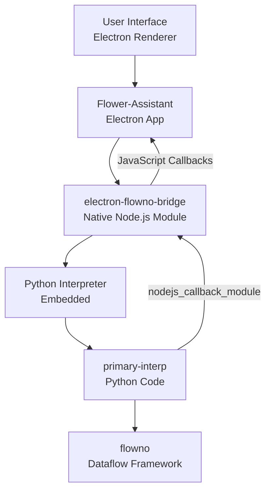
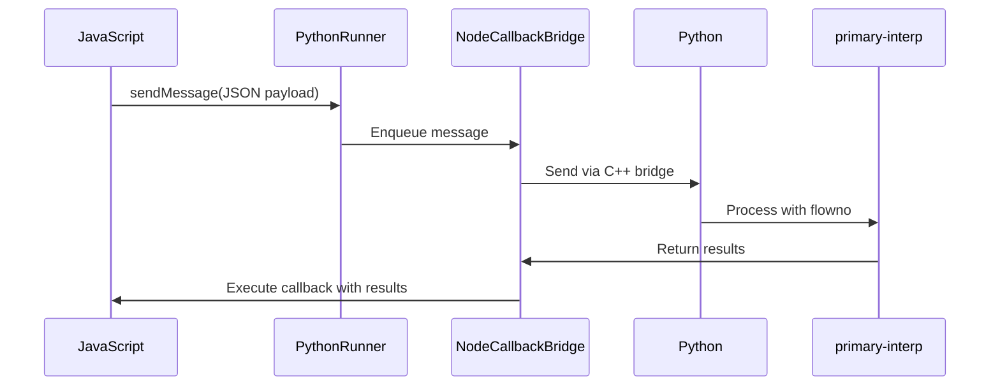

# Flower Assistant: System Architecture

## Overview

Flower Assistant is a multi-project application system that integrates Electron, a native Node.js module with Python embedding capabilities, and a custom Python dataflow framework to create a responsive and powerful chatbot application.

## System Components

The system consists of four key components:

1. **Flower-Assistant** - The main Electron application that serves as the user interface and system orchestrator.
2. **electron-flowno-bridge** - A native Node.js module that embeds a Python interpreter with C-extension libraries for IPC between Node.js and Python runtimes.
3. **flowno** - A standalone Python dataflow framework that enables concurrent and reactive operations.
4. **primary-interp** - Python code run by Flower-Assistant through electron-flowno-bridge to implement chatbot functionality using the flowno dataflow library.

## Architecture Diagram

## Data Flow

1. User input is captured in the Electron renderer process and passed to the main process
2. The main process sends messages to the embedded Python interpreter via electron-flowno-bridge
3. Python code in primary-interp processes these messages using the flowno dataflow framework
4. Results are sent back to Electron through the nodejs_callback_module
5. The UI is updated with the response

## Cross-Language Communication

Communication between JavaScript (Node.js) and Python occurs through the electron-flowno-bridge module:

## Component Details

### Flower-Assistant (Electron App)

- **Technologies**: Electron, TypeScript, React
- **Role**: Provides the user interface and manages the application lifecycle
- **Key Files**:
  - `main-entry.ts`: Entry point for the Electron main process
  - `renderer-entry.ts`: Entry point for the Electron renderer process

### electron-flowno-bridge (Native Node.js Module)

- **Technologies**: C++, Node-API, Python C API
- **Role**: Embeds Python interpreter and facilitates cross-language communication
- **Key Components**:
  - `PythonEnvironment`: Manages the Python interpreter lifecycle
  - `PythonRunner`: Handles message passing between JavaScript and Python
  - `NodeCallbackBridge`: Enables Python code to call JavaScript functions

### flowno (Python Dataflow Framework)

- **Technologies**: Pure Python
- **Role**: Provides reactive and concurrent programming capabilities
- **Documentation**: Comprehensive documentation available in the flowno/docs directory (using Sphinx)

### primary-interp (Python Application)

- **Technologies**: Python, flowno
- **Role**: Implements the chatbot functionality using the flowno framework
- **Key Files**:
  - `chat_app.py`: Main application logic
  - `renderer_message.py`: Message handling

## Development Environment

### Required Tools

- Node.js and Yarn
- Python 3.13
- C++ build tools (CMake, Ninja, Clang)

### Building and Running

1. Clone all repositories
2. Build electron-flowno-bridge
3. Install dependencies for flower-assistant
4. Run the application with `yarn start`

## Further Documentation

- **electron-flowno-bridge**: See `ProjectStructure.md` for detailed information about the bridge implementation
- **flowno**: Comprehensive documentation available in the flowno/docs directory using Sphinx
- **primary-interp**: Documentation will be expanded in its README.md file