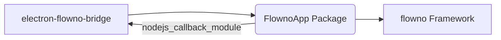

# Python Code Running in Primary Interpreter

## Overview

This package (`FlownoApp`) contains the Python code that runs in the primary interpreter embedded within the Flower Assistant application. It serves as the bridge between the Electron frontend and the flowno dataflow framework, implementing the core chatbot functionality.

## Architecture

The primary interpreter code is loaded and executed by the `electron-flowno-bridge` native module. It leverages the `flowno` dataflow framework to implement reactive and concurrent processing of user messages and API interactions.



## Key Components

The `FlownoApp` package is structured as follows:

*   **`app.py`**: Contains the main `ChatApp` class. This class initializes the application state, defines the Flowno dataflow graph by connecting various nodes, and registers the main message handler with the bridge. The `app` instance created here is the main entry point loaded by the `electron-flowno-bridge`.
*   **`messages/`**: Defines data structures.
    *   `domain_types.py`: Core internal data models (e.g., `Message`, `ChatSession`, `ApiConfig`, `AppState`) using dataclasses.
    *   `ipc_schema.py`: Dataclasses defining the structure of messages exchanged with the Electron frontend (IPC - Inter-Process Communication).
    *   `encoders.py`: Custom JSON encoders to serialize Python objects (domain types and IPC messages) for the LLM API and the Node.js bridge.
*   **`nodes/`**: Contains the individual Flowno nodes (`@node` decorated functions/classes) that represent the processing units in the dataflow graph (e.g., `GUIChat`, `ChatHistory`, `Inference`).
*   **`ipc/`**: Handles incoming messages from the Electron frontend.
    *   `context.py`: Defines `AppContext`, a simple container passed to handlers, providing access to application state, queues, etc.
    *   `registry.py`: Defines the `MESSAGE_HANDLERS` dictionary, mapping message type strings (e.g., `"new-prompt"`) to specific handler functions.
    *   `handler.py`: Contains the central `handle_message` function which receives raw messages from the bridge, looks up the appropriate handler in the registry, and calls it with the message payload and `AppContext`.
    *   `handlers/`: Subdirectory containing the actual handler functions for each specific message type.
*   **`services/`**: (Currently empty) Intended for business logic or interactions with external systems that don't fit into nodes or IPC handlers.

## Data Flow

The application processes data through a Flowno graph defined in `app.py`:

```python
with FlowHDL() as f:
    # GUIChat receives prompts from queue and sends chunks to the frontend
    f.gui_chat = GUIChat(self.prompt_queue, f.inference)
    
    # Inference consumes message history and produces stream of chunks
    f.inference = Inference(f.history, self.app_state.api_config)
    
    # ChunkContents extracts content strings from chunks
    f.chunk_contents = ChunkContents(f.inference)
    
    # ChatHistory receives prompts and accumulated response content
    f.history = ChatHistory(f.gui_chat, f.chunk_contents)
```

This graph forms a cycle (dependency loop) between nodes, which is a valid pattern in Flowno. The cycle represents the continuous conversation flow:
1. User sends a prompt (`GUIChat`)
2. Message history is updated (`ChatHistory`)
3. LLM is called with the history (`Inference`)
4. Chunks are processed (`ChunkContents`) and sent back to user (`GUIChat` via streaming)
5. Complete response is added to history (`ChatHistory`)
6. Cycle repeats with the next user prompt

## Communication Flow

1.  The Electron frontend sends a message (structured according to `messages/ipc_schema.py`) via `electron-flowno-bridge`.
2.  The bridge passes the message dictionary to the `handle_task` callback registered in `app.py`, which schedules `ChatApp.handle_message` within the Flowno event loop.
3.  `ChatApp.handle_message` calls the central `ipc.handler.handle_message` function.
4.  `ipc.handler.handle_message` uses the message `type` to find the correct handler function in `ipc.registry.MESSAGE_HANDLERS`.
5.  The specific handler function (from `ipc/handlers/`) is executed, using the `AppContext` to interact with application state (`AppState`), put items onto queues (`prompt_queue`), or potentially trigger other actions.
6.  Flowno nodes (like `GUIChat`) process data and use the `nodejs_callback_bridge` (configured with `NodeJSMessageJSONEncoder`) to send responses or updates (structured according to `messages/ipc_schema.py`) back to the Electron frontend.

## Extending the Application

### Adding a New Message Type

To add a new IPC message type:

1. Define the message structure in `messages/ipc_schema.py`
2. Create a handler function in the appropriate file in `ipc/handlers/`
3. Add the handler to the `MESSAGE_HANDLERS` dictionary in `ipc/registry.py`

### Adding New Nodes to the Graph

To add new processing capabilities:

1. Create new node(s) in the `nodes/` directory using the `@node` decorator
2. Update the graph definition in `app.py` to incorporate the new node(s)

### Avoiding Circular Imports

The codebase uses a layered approach to avoid circular imports:
- Core abstractions and data models are defined in `messages/domain_types.py`
- Shared dependencies like `AppContext` are in their own files (`ipc/context.py`)
- Higher-level components like handlers only import from lower-level modules
- `app.py` sits at the top, importing from all other modules as needed

## Development

1. Install any required Python packages to the `./python-dev-packages` site-packages directory:
   ```
   pip install --target=./python-dev-packages -e ../flowno
   pip install --target=./python-dev-packages any-other-dependencies
   ```

2. Make sure the `PythonRunner` has `extra_search_paths` set to include the `python-dev-packages` directory (see `src/infra/electron/ElectronFlownoBridge.ts`).

3. Start the electron app with `yarn start`.

## Packaging

The parent project (Flower Assistant) uses Electron Forge to package the application and executes pip install on the built wheel file using the embedded Python interpreter. (See `forge.config.js` postPackage hook.)

You must construct the wheel file before packaging the application.

```bash
cd src/infra/python/primary-interp
python -m build
```
## Integration with flowno

This package uses the flowno dataflow framework to implement reactive and concurrent processing. The ChatApp class sets up a flowno graph that processes messages in a reactive manner.

For detailed documentation on the flowno framework, refer to the flowno project docs.
