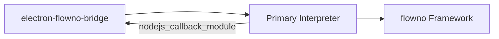

# Python Code Running in Primary Interpreter

## Overview

This package contains the Python code that runs in the primary interpreter embedded within the Flower Assistant application. It serves as the bridge between the Electron application and the flowno dataflow framework, implementing the core chatbot functionality.

## Architecture

The primary interpreter code is loaded and executed by the electron-flowno-bridge native module. It leverages the flowno dataflow framework to implement reactive and concurrent processing of user messages.



## Key Components

### ChatApp (chat_app.py)

The main application class that initializes the flowno dataflow graph and handles message processing. It:

1. Configures the flowno dataflow graph
2. Processes incoming messages from the Electron application
3. Returns responses via the nodejs_callback_module

### RendererMessage (renderer_message.py)

Defines the message structure for communication between the Electron application and the Python code.

## Communication Flow

1. The Electron application sends a message to the embedded Python interpreter via electron-flowno-bridge
2. The message is received by the Primary Interpreter and processed by ChatApp
3. ChatApp uses the flowno framework to process the message concurrently and reactively
4. The response is sent back to the Electron application via the nodejs_callback_module

## Development

### Setup

1. Install the required Python packages:
   ```
   pip install -e .
   ```

2. Make sure the flowno framework is installed.

### Testing

Tests can be run using pytest:

```
pytest
```

## Integration with flowno

This package uses the flowno dataflow framework to implement reactive and concurrent processing. The ChatApp class sets up a flowno graph that processes messages in a reactive manner.

For detailed documentation on the flowno framework, refer to the flowno project docs.
